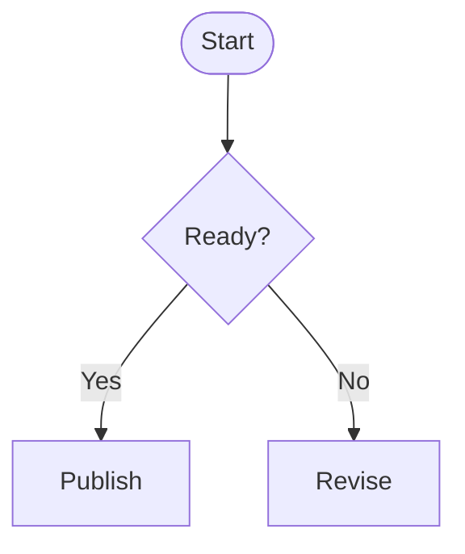
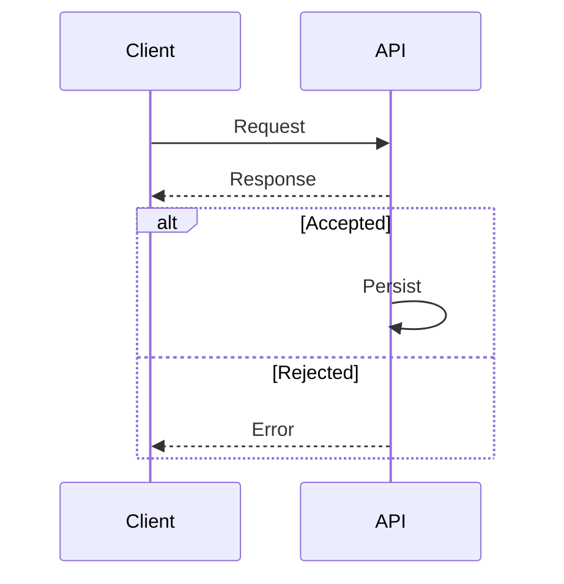

# Mermaid Diagrams

Use one diagram to answer one question. Keep labels short, give every node one
meaning, and show only relationships needed for the reader's decision. Use the
domain's terms rather than framework-specific substitutes.

## Choose the diagram

- **Flowchart**: process, decision, dependency, or component/data flow.
- **Sequence diagram**: messages and their order between participants.
- **State diagram**: lifecycle and transitions.
- **Class or ER diagram**: structural or data relationships.
- **Git graph**: branch and merge history.

## Flowchart

Use `flowchart TD`/`TB` for top-to-bottom or `flowchart LR` for left-to-right.
`graph` is also supported. Nodes use `[rectangle]`, `(rounded)`, `{decision}`,
`((circle))`, and `([terminal])`; `-->`, `-.->`, and `==>` are solid, dotted,
and thick arrows. Label an edge with `-->|label|`.

Use a stable node ID with a quoted display label when the label contains special
characters. Close each `subgraph` with `end`. Do not use a node label exactly
equal to lowercase `end`; give an unspaced connector target beginning with `o`
or `x` a leading space or capitalization.

## Sequence diagram

Declare readable actors with `participant id as Label`. `->` and `-->` are solid
and dotted lines without arrowheads; `->>` and `-->>` add arrowheads. `-)` and
`--)` are open async arrows. These forms describe rendering, not whether a call
is synchronous or a response.

Use `loop`, `alt`/`else`, `opt`, and `par` only for real control flow, and close
each with `end`. Add context with `Note right of api: text` when it prevents a
misread.

## Structure and data diagrams

- **Class**: start `classDiagram`; use `+`, `-`, and `#` for public, private,
  and protected members; `<|--`, `*--`, and `o--` for inheritance, composition,
  and aggregation. Put cardinality in quotes: `"1" --> "0..*"`.
- **State**: start `stateDiagram-v2`; use `[*]` for start or end and
  `StateA --> StateB : event` for a transition. Nest only related substates in
  `state Parent { ... }`.
- **ER**: start `erDiagram`; use `||--o{`, `||--||`, and `}o--o{` for one-to-many,
  one-to-one, and many-to-many. Put attributes in `{}` and mark PK, FK, or UK.
- **Git**: start `gitGraph`; use `branch name`, `checkout name`, `commit id:
  "label"`, and `merge name` for actual history.

For an architecture overview, use `flowchart TB` with `subgraph "Layer"` for
layers, or `flowchart LR` and labeled edges such as `-->|HTTP|` for interaction.

## Check

Close every control or grouping block, use syntax for the selected diagram type,
and render the completed diagram in the document's target. Give surrounding
prose a short conclusion or caption, so the document remains understandable if
the diagram does not render.
